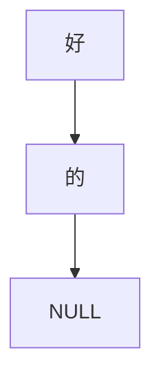

## Prefix Tree

Given a string `好的`, the generated structure looks like this:



### Usage
```c
#include "prefix_tree.h'

int main() {
  Prefix_Node pn = {0};
  pn_insert(&pn, "hello, world!");
  pn_insert(&pn, "welcome");
  pn_insert(&pn, "hello everyone");
}
```
