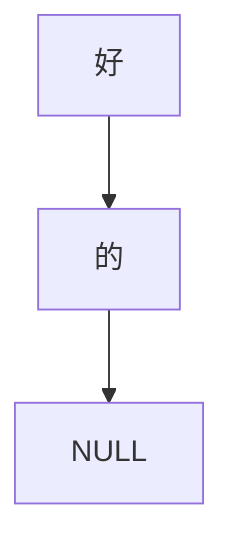

## Prefix Tree

Given a string `好的`, the generated structure looks like this:



### Usage
```c
#include "prefix_tree.h'

int main() {
  const char *source = "好的";
  Prefix_Node *pn = pn_create(source);

  // pn(好) -> pn(的)
}
```
